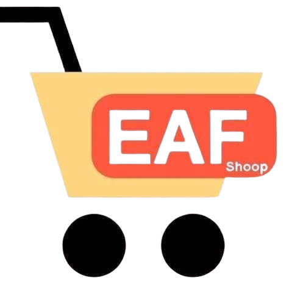

# EAF-Shoop online


A client-side e-commerce website template built with HTML, CSS, and vanilla JavaScript. It provides a rich user experience for browsing products, searching, and managing a shopping cart.

## Features

*   **Product Display:** Browse new products, a comprehensive list of all available items, and special promotions.
*   **Search Functionality:** Easily find products using the integrated search page.
*   **Shopping Cart:** A simple and effective shopping cart system.
*   **Error Handling:** A dedicated 404 error page for unhandled routes.

## Technologies Used

*   **HTML5:** For structuring the web content.
*   **CSS3:** For styling and visual presentation.
*   **JavaScript (ES6+):** For interactive functionalities and dynamic content.

## Project Structure

The project is organized into a clear and maintainable structure:

```
.
├── .gitignore
├── index.html
├── README.md
├── pages/
│   ├── error404.html
│   └── search.html
└── static/
    ├── css/
    │   ├── all-products.css
    │   ├── base.css
    │   ├── card.css
    │   ├── cart-modal.css
    │   ├── error404.css
    │   ├── new-products.css
    │   ├── promotions.css
    │   ├── search.css
    │   └── style.css
    ├── images/
    │   ├── 404.jpg
    │   ├── header.avif
    │   ├── logo.png
    │   ├── panier.png
    │   ├── promo.png
    │   └── products/
    │       ├── product1.avif
    │       ├── product2.avif
    │       └── product3.avif
    └── js/
        ├── all_products.js
        ├── cart.js
        ├── main.js
        ├── new_products.js
        ├── promotions.js
        └── search.js
```

## Setup and Usage

To run this project locally:

1.  Clone the repository.
2.  Navigate to the project directory.
3.  Open `index.html` in your web browser. No server setup is required.

## License

This project is licensed under the MIT License - see the [LICENCE.txt](LICENCE.txt) file for details.

---
*This project was created by EAF microservice.*